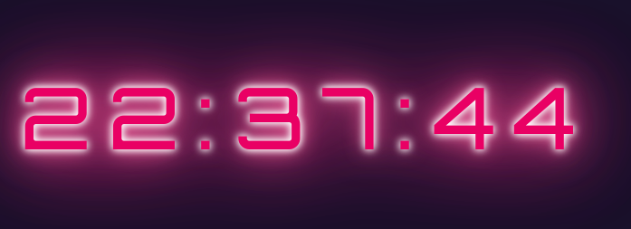

# Digital Watch

This is a simple digital watch project made with vanilla JS and classes.

## Features

- Displays current time with hours, minutes and seconds
- Updates the display every second
- Allows the user to start, pause and reset the watch

## Screenshot

## Usage

To use the digital watch, simply open the `index.html` file in your web browser. The watch will automatically start running and displaying the current time. You can use the buttons below the display to start, pause and reset the watch as desired.

## Credits

This project was created by [Alejandro Borges](https://github.com/AlexdelCarmen).

